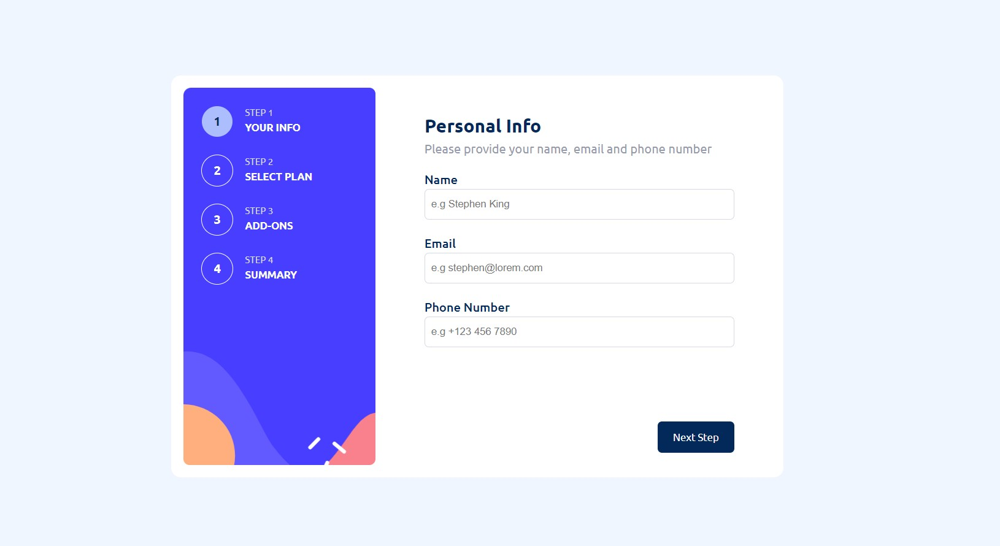

# Multi-step form solution - Frontend Mentor

This is a solution to the [Multi-step form challenge on Frontend Mentor](https://www.frontendmentor.io/challenges/multistep-form-YVAnSdqQBJ). Frontend Mentor challenges help you improve your coding skills by building realistic projects. 

## Table of contents

- [Overview](#overview)
  - [The challenge](#the-challenge)
  - [Screenshot](#screenshot)
  - [Links](#links)
- [My process](#my-process)
  - [Built with](#built-with)
  - [What I learned](#what-i-learned)
- [Author](#author)

## Overview

### The challenge

Users should be able to:

- Complete each step of the sequence
- See a summary of their selections on the final step and confirm their order
- View the optimal layout for the interface depending on their device's screen size
- See hover and focus states for all interactive elements on the page

### Screenshot



### Links

- Live Site URL: [Live link](https://multi-step-form-o.netlify.app/)

## My process

### Built with

- Semantic HTML5 markup
- CSS custom properties
- Flexbox
- CSS Grid
- Mobile-first workflow
- [React](https://reactjs.org/) - JS library


### What I learned
- CSS :has
```css
.addon-group {
  display: flex;
  justify-content: space-between;
  border: 1px solid var(--Light-gray);
  padding: 1rem;
  border-radius: 0.5rem;
}
.addon-group h2 {
  font-size: 1rem;
}

.addon-group:has(input:checked){
  border: 1px solid var(--Purplish-blue);
}
```


## Author

- Website - [@Osaaroh](https://osaaroh.vercel.app/)
- Frontend Mentor - [@Osaaroh](https://www.frontendmentor.io/profile/osaaroh)
